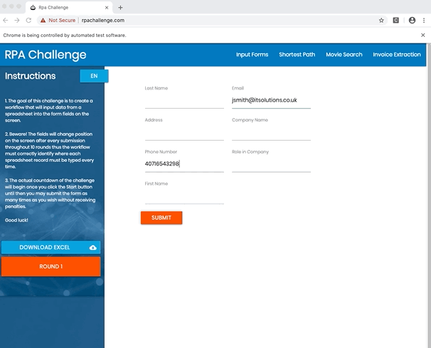
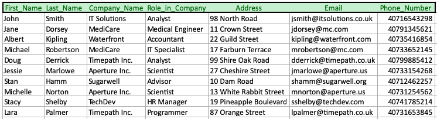
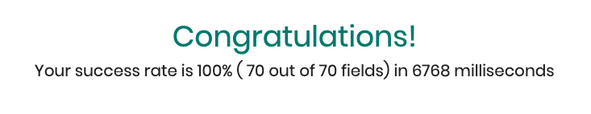
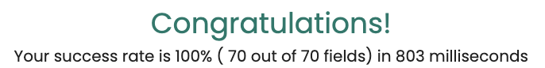

# RPA Form challenge example robot

This robot will solve the form challenge posted at http://rpachallenge.com.

Here's a video introduction to the challenge and this solution:

<YouTube url="https://www.youtube.com/embed/k-o9MqScDwM" />

The challenge consists of downloading an Excel spreadsheet, extracting its data and filling a form on the website with the extracted data ten times.

It sounds pretty simple! However, the catch is that each time the form gets submitted, the fields' position and order is shuffled around, so you need to find a good way to identify the right fields each time the form is displayed.



When run, our robot will:

- download the test Excel file from rpachallenge.com
- collect data from the downloaded Excel file
- start the challenge by clicking on the Start button
- loop through the data and fill the form ten times
- take a screenshot of the results page
- write log files
- close the browser

## Robot script

```robot
*** Settings ***
Documentation       Robot to solve the first challenge at rpachallenge.com,
...                 which consists of filling a form that randomly rearranges
...                 itself for ten times, with data taken from a provided
...                 Microsoft Excel file.

Library             RPA.Browser.Selenium
Library             RPA.Excel.Files
Library             RPA.HTTP


*** Tasks ***
Complete the challenge
    Start the challenge
    Fill the forms
    Collect the results


*** Keywords ***
Start the challenge
    Open Available Browser    http://rpachallenge.com/
    Download
    ...    http://rpachallenge.com/assets/downloadFiles/challenge.xlsx
    ...    overwrite=True
    Click Button    Start

Fill the forms
    ${people}=    Get the list of people from the Excel file
    FOR    ${person}    IN    @{people}
        Fill and submit the form    ${person}
    END

Get the list of people from the Excel file
    Open Workbook    challenge.xlsx
    ${table}=    Read Worksheet As Table    header=True
    Close Workbook
    RETURN    ${table}

Fill and submit the form
    [Arguments]    ${person}
    Input Text    css:input[ng-reflect-name="labelFirstName"]    ${person}[First Name]
    Input Text    css:input[ng-reflect-name="labelLastName"]    ${person}[Last Name]
    Input Text    css:input[ng-reflect-name="labelCompanyName"]    ${person}[Company Name]
    Input Text    css:input[ng-reflect-name="labelRole"]    ${person}[Role in Company]
    Input Text    css:input[ng-reflect-name="labelAddress"]    ${person}[Address]
    Input Text    css:input[ng-reflect-name="labelEmail"]    ${person}[Email]
    Input Text    css:input[ng-reflect-name="labelPhone"]    ${person}[Phone Number]
    Click Button    Submit

Set value by XPath
    [Arguments]    ${xpath}    ${value}
    ${result}=
    ...    Execute Javascript
    ...    document.evaluate('${xpath}',document.body,null,9,null).singleNodeValue.value='${value}';
    RETURN    ${result}

Collect the results
    Capture Element Screenshot    css:div.congratulations
    Close All Browsers
```

## Robot script explained

Now let's look at what we are telling our robot to do in detail.

### Settings section

In this section of the `tasks.robot` file, we add a description of our robot and reference the libraries that we want to use:

```robot
*** Settings ***
Documentation       Robot to solve the first challenge at rpachallenge.com,
...                 which consists of filling a form that randomly rearranges
...                 itself for ten times, with data taken from a provided
...                 Microsoft Excel file.

Library             RPA.Browser.Selenium
Library             RPA.Excel.Files
Library             RPA.HTTP
```

Our robot uses these three libraries:

- `RPA.Browser.Selenium`: to interact with the browser
- `RPA.Excel.Files`: to read the contents of our Excel file
- `RPA.HTTP`: to download the Excel file from the challenge website.

> These libraries are provided by the [rpaframework](/automation-libraries/rpa-framework-overview) package, a set of well-documented and actively maintained core libraries for Software Robot Developers.

### Tasks and Keywords

We are defining the challenge as a task that calls keywords coming from the libraries we are importing, and also some that we define ourselves.

### Task: `Complete the challenge`

```robot
*** Tasks ***
Complete the challenge
    Start the challenge
    Fill the forms
    Collect the results
```

### Keyword: `Start the challenge`

```robot
*** Keywords ***
Start the challenge
    Open Available Browser    http://rpachallenge.com/
    Download
    ...    http://rpachallenge.com/assets/downloadFiles/challenge.xlsx
    ...    overwrite=True
    Click Button    Start
```

Using the [`Open Available Browser`](/libraries/rpa-framework/rpa-browser-selenium/keywords#open-available-browser) keyword from [`RPA.Browser.Selenium`](/libraries/rpa-framework/rpa-browser-selenium), the robot will open a new browser and navigate to the challenge website. Then, using the [`Download`](/libraries/rpa-framework/rpa-http/keywords#download) keyword from [`RPA.HTTP`](/libraries/rpa-framework/rpa-http), it will download the Excel file locally, overwriting the file if it happens to exist already. Once the file is downloaded, it will start the challenge using the [`Click Button`](/libraries/rpa-framework/rpa-browser-selenium/keywords#click-button) keyword, provided by the [`RPA.Browser.Selenium`](/libraries/rpa-framework/rpa-browser-selenium) library.

> Because there are no other buttons with a label of "Start", we can just pass the label to the [`Click Button`](/libraries/rpa-framework/rpa-browser-selenium/keywords#click-button) keyword, and it will just work!

### Keyword: `Fill the forms`

This keyword is where most of the work is done. Let's have a look at it in detail:

```robot
*** Keywords ***
Fill the forms
    ${people}=    Get the list of people from the Excel file
    FOR    ${person}    IN    @{people}
        Fill and submit the form    ${person}
    END
```

1.  `${people}= Get the list of people from the Excel file`:

    Here we are creating a variable, and we are assigning to it the Excel data by using a new keyword that we called `Get the list of people from the Excel file`:

    ```robot
    *** Keywords ***
    Get the list of people from the Excel file
        Open Workbook    challenge.xlsx
        ${table}=    Read Worksheet As Table    header=True
        Close Workbook
        RETURN    ${table}
    ```

    We are using the [`RPA.Excel.Files`](/libraries/rpa-framework/rpa-excel-files) library to manipulate the Excel file (Keywords: [`Open Workbook`](/libraries/rpa-framework/rpa-excel-files/keywords#open-workbook), [`Read Worksheet As Table`](/libraries/rpa-framework/rpa-excel-files/keywords#read-worksheet-as-table), [`Close Workbook`](/libraries/rpa-framework/rpa-excel-files/keywords#close-workbook)), returning the data as a Table, so that we can iterate over it in the next step.

2.  Looping over the people data:

    Here we get the table rows data `@{people}`, and we call the `Fill and submit the form` keyword for each row `@{person}`, using a FOR loop.

    ```robot
    FOR    ${person}    IN    @{people}
        Fill and submit the form    ${person}
    END
    ```

3) `Fill and submit the form ${person}`

   Now that we have the data from one individual row, with this keyword we can fill the form on the page.

   The [`RPA.Browser.Selenium`](/libraries/rpa-framework/rpa-browser-selenium) library provides a keyword to set an input field ([`Input Text`](/libraries/rpa-framework/rpa-browser-selenium/keywords#input-text)), but how can we identify each form item? We cannot rely on the order of the fields or their position on the page because, as part of the challenge, they will move around each time we submit the form.

   _We have to dig deeper to find a reliable way to identify each field._ Let's have a look at the source code of the form inputs, for example the "First Name" field:

   ```html
   <label _ngcontent-c2="">First Name</label>
   <input
     _ngcontent-c2=""
     ng-reflect-name="labelFirstName"
     id="cu1Yq"
     name="cu1Yq"
     class="ng-pristine ng-invalid ng-touched"
   />
   ```

   Typically, we would use the `id`, or `name` HTML attributes to identify a form field, but the creators of the challenge did not make it easy for us because these attributes change each time the form is submitted. However, we can see that there is another attribute that does not change: `ng-reflect-name`. Let's use that one!

   So, using CSS, our locator for the "First Name" field will become:

   ```
   css:input[ng-reflect-name="labelFirstName"]
   ```

   > Learn more about [how to find interface elements in web applications and the concept of locators](/development-guide/browser/how-to-find-user-interface-elements-using-locators-in-web-applications).

   Now with our locators and the [`Input Text`](/libraries/rpa-framework/rpa-browser-selenium/keywords#input-text) keyword we can fill each field in the form with the corresponding data, and then click the `Submit` button:

   ```robot
   *** Keywords ***
    Fill and submit the form
        [Arguments]    ${person}
        Input Text    css:input[ng-reflect-name="labelFirstName"]    ${person}[First Name]
        Input Text    css:input[ng-reflect-name="labelLastName"]    ${person}[Last Name]
        Input Text    css:input[ng-reflect-name="labelCompanyName"]    ${person}[Company Name]
        Input Text    css:input[ng-reflect-name="labelRole"]    ${person}[Role in Company]
        Input Text    css:input[ng-reflect-name="labelAddress"]    ${person}[Address]
        Input Text    css:input[ng-reflect-name="labelEmail"]    ${person}[Email]
        Input Text    css:input[ng-reflect-name="labelPhone"]    ${person}[Phone Number]
        Click Button    Submit
   ```

   > Note: the keys in our `${person}` dictionary are the column headers from the first row of the Excel file:
   > 

### Keyword: `Collect the results`

```robot
 *** Keywords ***
Collect the results
    Capture Element Screenshot    css:div.congratulations
    [Teardown]    Close All Browsers
```

After all the forms have been filled, the site will display a congratulations message with statistics about the accuracy and how long it took to complete the challenge. Looking at HTML source of the page, we can see that the congratulations message has a CSS class of `congratulations`: the robot will take a screenshot of it (`Capture Element Screenshot`) and save it to a file.



At the end, we tell the robot to [`Close All Browsers`](/libraries/rpa-framework/rpa-browser-selenium/keywords#close-all-browsers).

**Job done!** (...or is it?)

## Right, now let's make it FAST! 🏎🔥🔥🔥

Well, we are **Software Robot Developers**, and there's nothing like a _challenge with a timer_ to make us want to shave seconds and milliseconds from our programs.

So we cannot just be happy about those 6.7 seconds that our robot took to complete the challenge. **It's time to optimize!**

The most time-consuming part of our task is the actual filling of the forms. We are using the [`Input Text`](/libraries/rpa-framework/rpa-browser-selenium/keywords#input-text) keyword, which makes for very readable and understandable code, but we realize it could be faster.

The [`RPA.Browser.Selenium`](/libraries/rpa-framework/rpa-browser-selenium) library allows us to write Javascript directly by using the [`Execute Javascript`](/libraries/rpa-framework/rpa-browser-selenium/keywords#execute-javascript) keyword. Let's try to fill the form that way!

Our plan is to use the [`document.evaluate` JavaScript method](https://developer.mozilla.org/en-US/docs/Web/API/Document/evaluate) to find the elements, which means we need to identify our input elements using [XPath](/development-guide/browser/how-to-find-user-interface-elements-using-locators-in-web-applications#other-locator-strategies-xpath) instead of CSS. Using XPath, our locators become:

```
//input[@ng-reflect-name="labelFirstName"]
```

After that, we can set the `value` property on the returned [`singleNodeValue`](https://developer.mozilla.org/en-US/docs/Web/API/XPathResult/singleNodeValue) object to fill the field. Easy!

Now, instead of using the [`Input Text`](/libraries/rpa-framework/rpa-browser-selenium/keywords#input-text) keyword, we can make our own keyword that will accept the XPath for the element, and the value we want to assign to it, and execute our simple script:

```
*** Keywords ***
Set value by XPath
    [Arguments]    ${xpath}    ${value}
    ${result}=
    ...    Execute Javascript
    ...    document.evaluate('${xpath}',document.body,null,9,null).singleNodeValue.value='${value}';
    RETURN    ${result}
```

So, with these changes, our robot code now becomes:

```robot
*** Settings ***
Documentation       Robot to solve the first challenge at rpachallenge.com,
...                 which consists of filling a form that randomly rearranges
...                 itself for ten times, with data taken from a provided
...                 Microsoft Excel file.
Library             RPA.Browser.Selenium
Library             RPA.Excel.Files
Library             RPA.HTTP


*** Tasks ***
Complete the challenge
    Start the challenge
    Fill the forms
    Collect the results


*** Keywords ***
Start the challenge
    Open Available Browser    http://rpachallenge.com/
    Download
    ...    http://rpachallenge.com/assets/downloadFiles/challenge.xlsx
    ...    overwrite=True
    Click Button    Start

Fill the forms
    ${people}=    Get the list of people from the Excel file
    FOR    ${person}    IN    @{people}
        Fill and submit the form    ${person}
    END

Get the list of people from the Excel file
    Open Workbook    challenge.xlsx
    ${table}=    Read Worksheet As Table    header=True
    Close Workbook
    RETURN    ${table}

Fill and submit the form
    [Arguments]    ${person}
    Set Value By XPath    //input[@ng-reflect-name="labelFirstName"]    ${person}[First Name]
    Set Value By XPath    //input[@ng-reflect-name="labelLastName"]    ${person}[Last Name]
    Set Value By XPath    //input[@ng-reflect-name="labelCompanyName"]    ${person}[Company Name]
    Set Value By XPath    //input[@ng-reflect-name="labelRole"]    ${person}[Role in Company]
    Set Value By XPath    //input[@ng-reflect-name="labelAddress"]    ${person}[Address]
    Set Value By XPath    //input[@ng-reflect-name="labelEmail"]    ${person}[Email]
    Set Value By XPath    //input[@ng-reflect-name="labelPhone"]    ${person}[Phone Number]
    Click Button    Submit

Set value by XPath
    [Arguments]    ${xpath}    ${value}
    ${result}=
    ...    Execute Javascript
    ...    document.evaluate('${xpath}',document.body,null,9,null).singleNodeValue.value='${value}';
    RETURN    ${result}

Collect the results
    Capture Element Screenshot    css:div.congratulations
    Close All Browsers
```

So now, when we run it, our execution time becomes:



**Now that's much better!**

This fun little exercise shows that when you, as a developer, are in control, you can optimize extensively. In this case, we wanted speed, and we were willing to sacrifice a bit of code readability and slightly deviate from the standard to achieve it. It's your job to decide what's best for your specific implementation. **But it's nice to have options, isn't it?**

> This example contains two versions of the robot - one written in Robot Framework syntax, the other in Python.

```python
from RPA.Browser.Selenium import Selenium
from RPA.Excel.Files import Files
from RPA.HTTP import HTTP

browser_lib = Selenium()


def get_the_list_of_people_from_the_excel_file():
    excel_lib = Files()
    excel_lib.open_workbook("challenge.xlsx")
    table = excel_lib.read_worksheet_as_table(header=True)
    excel_lib.close_workbook()
    return table


def set_value_by_xpath(xpath, value):
    script = f"document.evaluate('{xpath}',document.body,null,9,null).singleNodeValue.value='{value}';"
    return browser_lib.execute_javascript(script)


def fill_and_submit_the_form(person):
    names_and_keys = {
        "labelFirstName": "First Name",
        "labelLastName": "Last Name",
        "labelCompanyName": "Company Name",
        "labelRole": "Role in Company",
        "labelAddress": "Address",
        "labelEmail": "Email",
        "labelPhone": "Phone Number",
    }
    for name, key in names_and_keys.items():
        set_value_by_xpath(f'//input[@ng-reflect-name="{name}"]', person[key])
    browser_lib.click_button("Submit")


def start_the_challenge():
    browser_lib.open_available_browser("http://rpachallenge.com/")
    HTTP().download(
        "http://rpachallenge.com/assets/downloadFiles/challenge.xlsx",
        overwrite=True)
    browser_lib.click_button("Start")


def fill_the_forms():
    people = get_the_list_of_people_from_the_excel_file()
    for person in people:
        fill_and_submit_the_form(person)


def collect_the_results():
    browser_lib.capture_element_screenshot("css:div.congratulations")
    browser_lib.close_all_browsers()


if __name__ == "__main__":
    start_the_challenge()
    fill_the_forms()
    collect_the_results()
```

## Summary

Using this example robot, you learned some concepts and features of both Robot Framework and RPA Framework:

- Downloading a remote file via the RPA.HTTP library (`Download`)
- Reading Excel files and working with the data (`RPA.Excel.Files`)
- Locating specific elements in a webpage using their label or a custom attribute with XPath
- Filling web forms and clicking buttons (`Input Text`, `Click Button`)
- Taking screenshots of elements of a webpage (`Capture Element Screenshot`)
- Taking alternative strategies to optimize your robot's execution times

